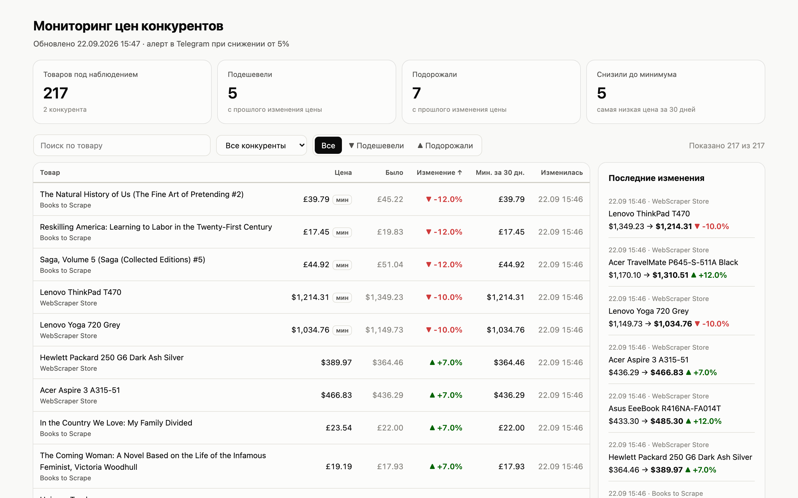

# Мониторинг цен конкурентов · Competitor price monitor

**RU** · [EN below](#english)

> Скриншот ниже — реальный прогон по двум тренировочным магазинам для парсинга (217 товаров, 25 секунд).
> Видео 40 сек: [ссылка]



## Задача

Магазин следит за ценами конкурентов руками: раз в неделю кто-то открывает десяток сайтов и сравнивает.
Снижение цены у конкурента замечают через несколько дней, когда продажи уже просели.

## Решение

Скрипт по расписанию обходит сайты конкурентов, складывает цены в историю и:

- **присылает алерт в Telegram**, если кто-то снизил цену на 5% и больше (порог настраивается);
- обновляет **таблицу**: Excel-файл всегда, Google Sheets при подключённом ключе. Колонки: текущая цена,
  прошлая, изменение в %, минимум за 30 дней, ссылка;
- собирает **HTML-отчёт** с поиском, фильтрами и историей изменений (на скриншоте выше).

Пример алерта (текст из реального прогона):
```
📉 Снижение цен у конкурентов: 5
• Books to Scrape · The Natural History of Us (The Fine Art of Pretending #2)
   £45.22 → £39.79 (-12.0%)
• WebScraper Store · Lenovo ThinkPad T470
   $1,349.23 → $1,214.31 (-10.0%)
…
Всего товаров под наблюдением: 217. Открыть таблицу
```

Новый конкурент добавляется блоком в `config.yaml`, код менять не нужно:

```yaml
- name: Конкурент Х
  start_url: https://example.ru/catalog/laptops
  item: .product-card          # карточка товара
  title: .product-card__name   # название
  price: .price-current        # цена: «1 299 ₽», «$1,178.99», «12 990,50 руб.» — всё разбирается
  link: a@href                 # «@атрибут» — взять атрибут, а не текст
  next_page: a.next@href       # пагинация
  currency: RUB
  max_pages: 10
```

**Что сделано, чтобы не было ложных тревог и молчаливых поломок:**
- сайт упал или ответил 5xx → 3 попытки с нарастающей паузой; остальные конкуренты собираются как обычно,
  в алерте появляется строка «🛠 Не удалось собрать: …»;
- поменялась вёрстка и найдено 0 товаров → это ошибка в алерте, а не «все товары пропали». Старые цены остаются;
- цена упала больше чем на 70% → отдельный блок «проверьте вручную, похоже на ошибку на сайте»;
- уважается `robots.txt`, между запросами к одному сайту пауза 1 с, User-Agent честно представляется;
- цены хранятся в копейках (`int`), без ошибок округления float;
- второй прогон не стартует, пока идёт первый: файловый замок, безопасно для cron.

## Стек

Python 3.12 · httpx · BeautifulSoup + lxml · SQLite · openpyxl · gspread · Docker.
Около 1 000 строк кода и 28 тестов. Тесты работают без интернета: сохранённые страницы
и подменённый HTTP-транспорт покрывают падения сайтов, 404/503, смену вёрстки и robots.txt.

```
config.yaml            какие сайты и какие селекторы
monitor/fetch.py       HTTP: повторы, таймауты, robots.txt, паузы
monitor/parse.py       карточки товаров и разбор цен в любом формате
monitor/storage.py     SQLite: история цен, изменения, минимум за 30 дней
monitor/run.py         один прогон: источники изолированы друг от друга
monitor/alerts.py      сообщение в Telegram (≤ 4096 символов, HTML экранирован)
monitor/exporters/     Excel, Google Sheets, HTML-отчёт
```

## Запуск

```bash
python3.12 -m venv .venv && . .venv/bin/activate
pip install -r requirements-dev.txt
pytest                                    # 28 тестов, < 1 сек
python -m monitor check                   # проверить селекторы: первая страница каждого сайта
python -m monitor run                     # прогон → output/prices.xlsx, output/report.html
python -m monitor run --demo-shuffle 6    # для видео: сдвинуть цены у 6 товаров (см. ниже)
```

Telegram и Google Sheets включаются через `.env` (пример — `.env.example`).
На сервере: `docker compose up -d` — прогон раз в час, результаты в `./output`.
Без Docker: `deploy/crontab.example`.

**Про `--demo-shuffle`.** На тренировочных сайтах цены не меняются никогда, поэтому показать алерт на них
нельзя. Флаг перед сохранением сдвигает цены у нескольких случайных товаров на ±7–18%.
Это единственное место, где данные не настоящие, и оно отключено по умолчанию. Следующий обычный прогон
вернёт настоящие цены, и в истории это будет видно как обратное изменение. Начать с чистого листа:
`rm output/prices.db`.

## Под заказчика

| Задача | Как |
|---|---|
| Сайт с обычной вёрсткой | блок в `config.yaml`, ≈15 минут на сайт |
| Сайт рисует цены через JavaScript | Playwright вместо httpx, ≈2 часа |
| Сопоставить одни и те же товары у разных конкурентов | колонка «наш артикул» + таблица соответствий |
| Маркетплейсы (Ozon, WB) | через их API или официальные выгрузки, а не парсинг HTML |

---

<a name="english"></a>
## English

**Scrapes competitor prices on a schedule, keeps price history, and pings Telegram when someone drops a price.**

- Config-driven: a new competitor is a YAML block with CSS selectors, no code changes.
- Outputs: Telegram alert (one message per run, drops ≥ 5%), Excel and Google Sheets table
  (current / previous / change % / 30-day low), and a self-contained HTML report with search and filters.
- Robust: retries with backoff on 5xx/timeouts, per-source isolation, "0 items = layout changed" treated
  as an error (not as "everything disappeared"), suspicious > 70% drops flagged separately, robots.txt
  respected, prices stored as integer cents, file lock against overlapping cron runs.

**Stack:** Python 3.12, httpx, BeautifulSoup/lxml, SQLite, openpyxl, gspread, Docker.
About 1,000 lines of code, 28 offline tests (saved HTML fixtures + mocked HTTP transport).
The screenshot is a real run against two public scraping sandboxes (217 products, 25 s).
